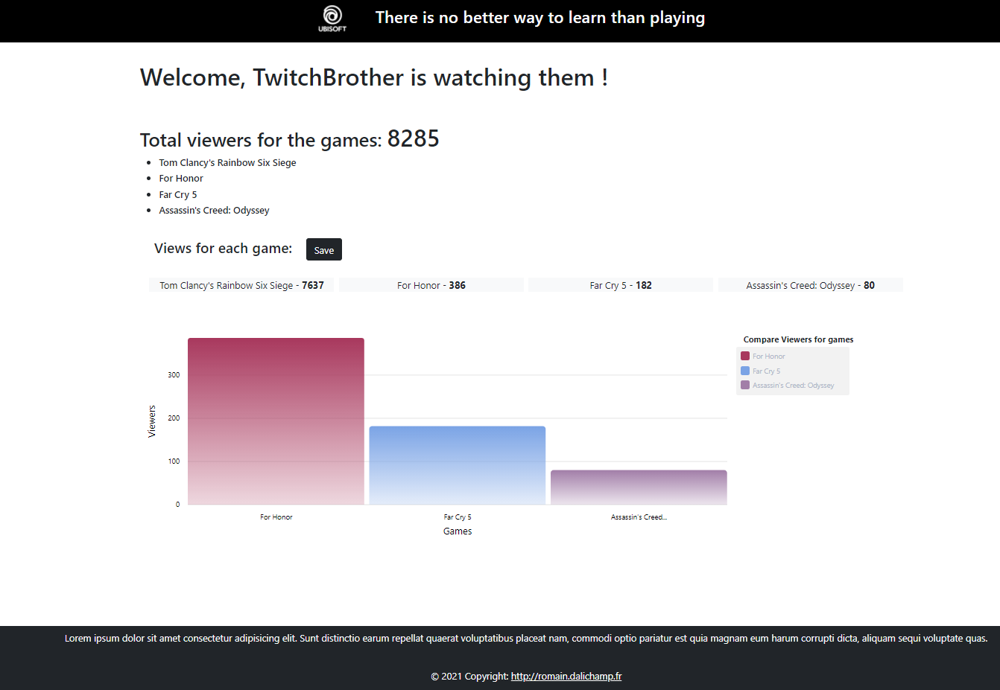

# TwitchBrotherBack

Java Micro Service with 
- a Twitch Client to Poll Twitch API as fast as possible / authorized
- a websocket server pushing the results of the streaming datas to any connected client
- a bar chart to compare datas betweens the games
- You have to download and install the client (Angular 12) to consult all the analytics (see Frontend section)

## SonarCloud

- deployed on Heroku here: https://dashboard.heroku.com/apps/twitch-brother-back

## Pre-installation

Open Jdk - Java
- You may need to install if not OpenJdk: https://openjdk.java.net/install/

Redis
- Download and install Redis: https://github.com/microsoftarchive/redis/releases
  - Leave default values, as Hostname = `localhost` and port `6379`
  - Add redis repository to the `PATH` (Check box with MSI version)
  - with the default MSI version, windows starts autmatically a redis server as a service after installation
  - from any cmd enter `redis-cli`
  - to see the saved results, enter `KEYS *` or use a GUI Client: https://www.npmjs.com/package/redis-commander

Maven
- Download and install maven: https://maven.apache.org/download.cgi
 
## Installation

Environment Variables

### Solution 1
- use the POM file sent via email including the environment variables, and replace the existing one with

### Solution 2
add the dependencies on your system
- how to define theses variables in Intellij: https://www.jetbrains.com/help/objc/add-environment-variables-and-program-arguments.html#add-environment-variables
- Define following environment variables: - values will be provided to you by email
  - `TWITCH_CLIENT_ID`= xxx
  - `TWITCH_CLIENT_SECRET`= xxx
  - `ALLOWED_ORIGIN`= http://localhost:4200
  - `GAMES_LIST`=`460630,497078,506274,490382`

to add them easily: `TWITCH_CLIENT_ID=xxx;TWITCH_CLIENT_SECRET=xxx;ALLOWED_ORIGIN=http://localhost:4200;REDIS_HOSTNAME=localhost;REDIS_PORT=6379;GAMES_LIST=460630,497078,506274,490382`
Install dependencies
  - `mvn clean install`

## Deploy
- `mvn spring-boot:run` on port `8080`, http:"//localhost:8080
- you can modify the `GAMES_LIST` Environement Variable with any game id, pick one Category here https://www.twitch.tv/ubisof?lang=fr and look at "Category" in the URL
  - for example Watch Dogs is: https://www.twitch.tv/ubisoft/videos?filter=archives&category=512895
- run `mvn spring-boot:run -Dspring.profiles.active=dev` to display more logs
## Server

This server is running correctly if the logs are looking like: 

## Frontend

You can copy and install the repository from: https://github.com/fukakai/TwitchBrother

